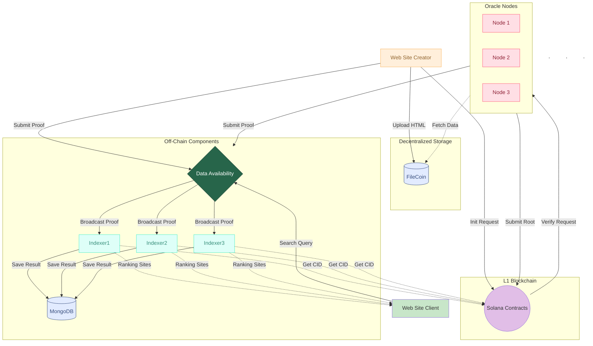

# OpenSEO

Decentralized SEO verification platform. Website owners submit HTML and keywords; the system generates Zero-Knowledge proofs, stores data on-chain and in a Data Availability layer, and verification nodes reach consensus on content roots. Users search and verify results via the frontend.

### Apps

- **Backend** HTML upload, ZK proof generation, contract submission, DA broadcast. Prover in the ZK flow.
  [github-action](apps/github-action/README.md)
- **Frontend** Search UI and proof verification. Queries indexer, verifies proofs in the browser.
  [frontend](apps/frontend/README.md)
- **Indexer** Stores and queries ZK proof metadata. Ingests DA broadcasts, verifies on-chain + ZK, exposes search and verify APIs.
  [indexer](apps/indexer/README.md)
- **Oracle Node** Verification nodes (Node1–3). Listen for contract events, fetch HTML from Filecoin, compute root, vote on-chain.
  [oracle-node](apps/oracle-node/README.md)
- **Worker Filecoin** (Cloudflare) HTML storage in R2. POST /send_file, GET /html_file/:cid
  [worker-filecoin](apps/worker-filecoin/README.md)
- **Worker DA** (Cloudflare) Data Availability: POST /submit_proof, WebSocket /ws, GET /submissions. Broadcasts to indexers.
  [worker-da](apps/worker-da/README.md)

### Packages

- **@openseo/contracts** OpenSEO Solana contract (verification requests, node voting, consensus). IDL and deploy scripts.
  [contracts](packages/contracts/README.md)
- **@openseo/zkproof** ZK proof generation and verification (Noir/Barretenberg). HTML parsing, circuit proof, ProofVerifier.
  [zkproof](packages/zkproof/README.md)
- **@openseo/types** Shared TypeScript types.

## Installation

pnpm install

## Quick start (local)

1. `pnpm install`
2. **All services** `pnpm dev`
   - With Turbo, the github-action, frontend, indexer, and oracle node start in parallel. Deployed workers are used for DA and Filecoin (you don't need to run local workers).
3. **Deploy contract one time** Please read this [contracts](packages/contracts/README.md)
   - Write `PROGRAM_ID` and `SOLANA_RPC_URL` on github-action, indexer and oracle-node' s `.env` file.

Then open the frontend URL (e.g. `http://localhost:3000`) to search and verify.

# High-Level Diagram:

# Use-Case Diagrams:

